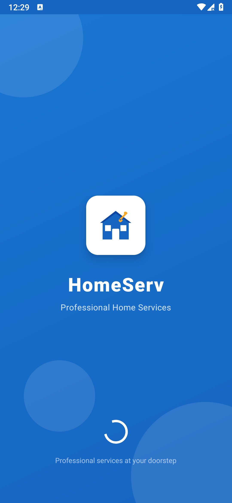
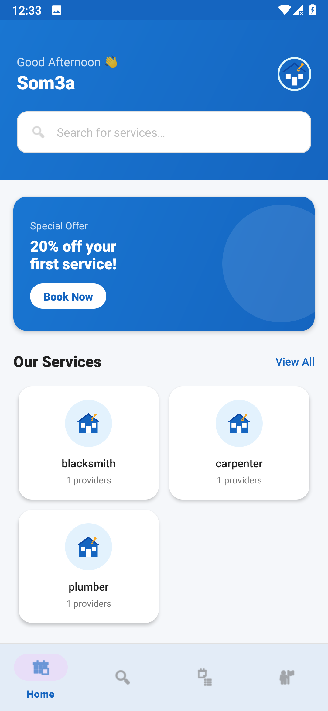
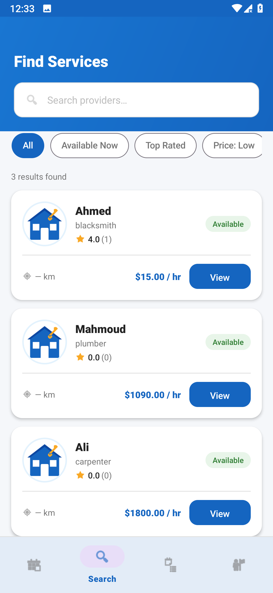
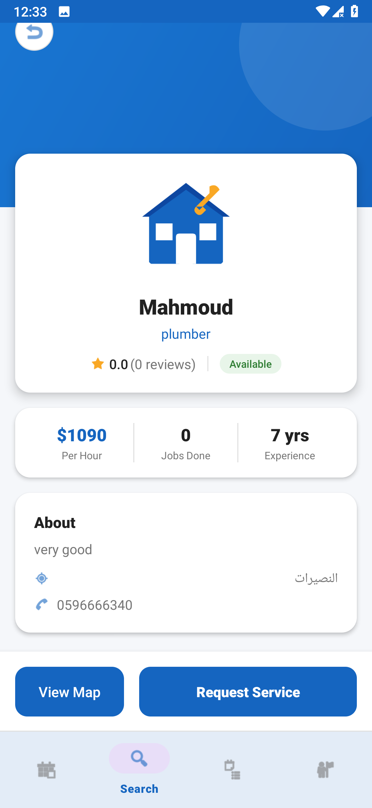
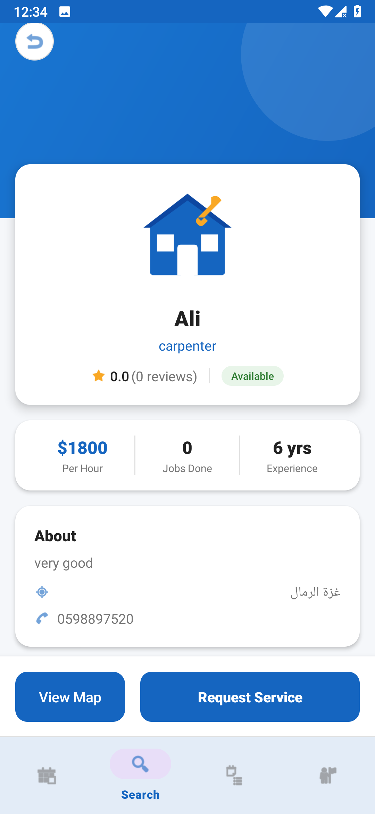
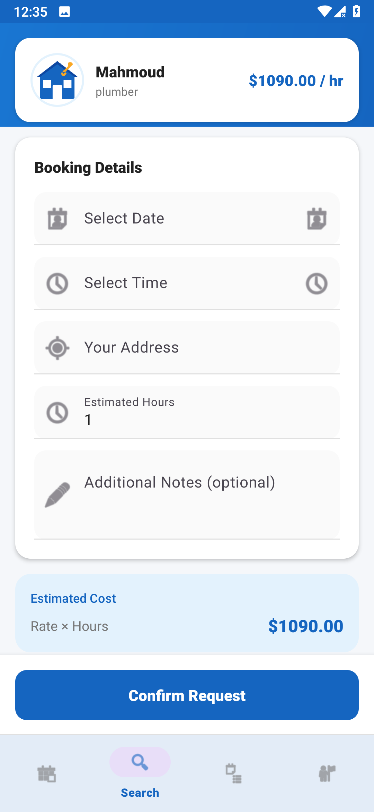
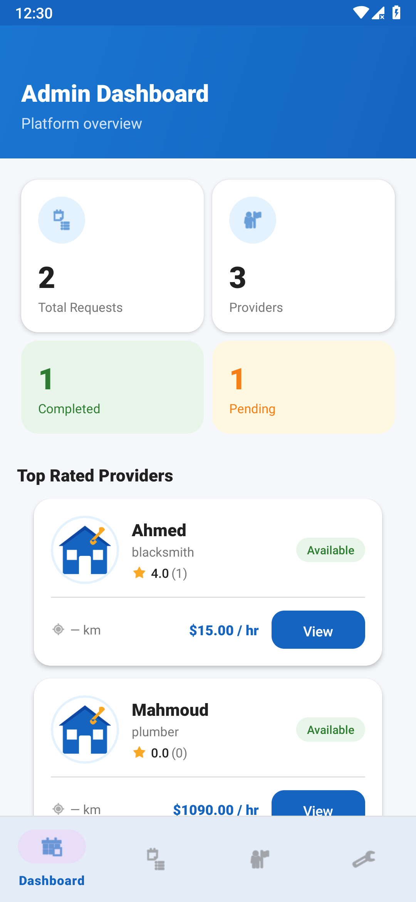
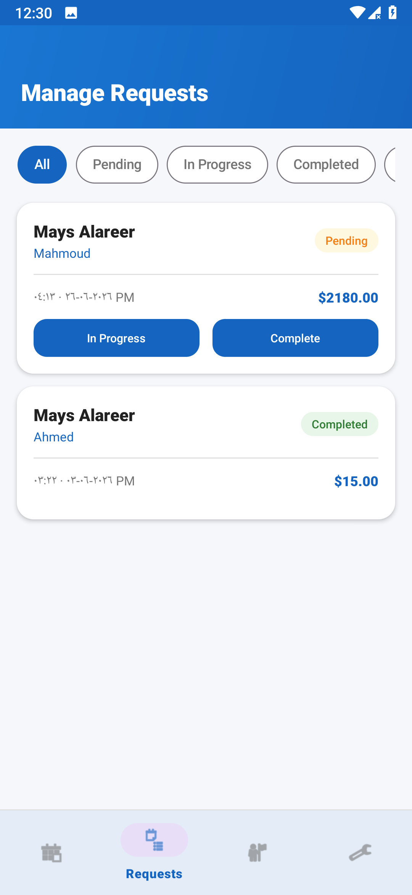
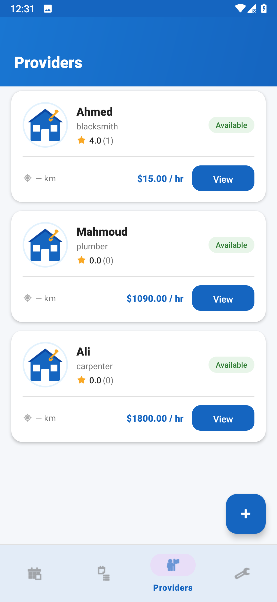
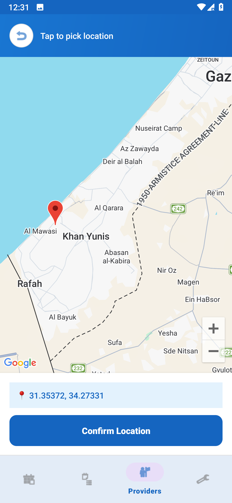

# 🏠 HomeServ — Home Services Marketplace

> A modern Android application that connects homeowners with professional home service providers.

---

## 📱 Screenshots

### Customer Side

| Splash Screen | Home Screen | Search Screen |
|:---:|:---:|:---:|
|  |  |  |

| Provider Detail | Provider Detail | Request Service |
|:---:|:---:|:---:|
|  |  |  |

### Admin Side

| Admin Dashboard | Manage Requests | Manage Providers |
|:---:|:---:|:---:|
|  |  |  |

| Map Location Picker | &nbsp; | &nbsp; |
|:---:|:---:|:---:|
|  | | |

---

## ✨ Features

### 👤 Customer
- Browse service providers by category (Plumbing, Electrical, Carpentry, Cleaning, etc.)
- Search & filter by name, rating, price, and availability
- View provider details: rating, price/hr, experience, jobs done
- Book services with date, time, address scheduling
- Estimated cost calculator
- Track order status in real-time
- Rate completed services (1–5 stars)
- View provider location on Google Maps

### 🛡️ Admin
- Dashboard with live statistics (Total Requests, Providers, Completed, Pending)
- Top Rated Providers list
- Most Requested Services chart
- Manage service categories (Add / Edit / Delete)
- Manage providers with interactive map location picker (Add / Edit / Delete)
- Manage and update service requests status (Pending → In Progress → Completed)

---

## 🛠️ Tech Stack

| Technology | Usage |
|:----------|:------|
| **Kotlin** | Primary programming language |
| **MVVM Architecture** | Clean separation of concerns |
| **Firebase Authentication** | Secure user login & registration |
| **Firebase Firestore** | Cloud NoSQL database |
| **Google Maps SDK** | Interactive maps & location picking |
| **Jetpack Navigation** | Fragment navigation management |
| **Coroutines + LiveData** | Async operations & reactive UI |
| **Material Design 3** | Modern UI components |
| **Glide** | Efficient image loading |
| **ViewBinding** | Type-safe view access |
| **Shimmer** | Smooth skeleton loading effect |
| **CircleImageView** | Circular provider avatars |

---

## 🏗️ Architecture — MVVM

```
┌─────────────────────────────────────┐
│           UI Layer                   │
│    (Fragments + Activities + XML)    │
│         observes LiveData            │
└──────────────┬──────────────────────┘
               │
┌──────────────▼──────────────────────┐
│         ViewModel Layer              │
│   (HomeViewModel, SearchViewModel,   │
│    AuthViewModel, OrdersViewModel)   │
│       calls suspend functions        │
└──────────────┬──────────────────────┘
               │
┌──────────────▼──────────────────────┐
│        Repository Layer              │
│  (AuthRepository, ProviderRepository │
│   CategoryRepository, RequestRepo)   │
│         uses .await()                │
└──────────────┬──────────────────────┘
               │
┌──────────────▼──────────────────────┐
│          Data Layer                  │
│   Firebase Firestore + Local Storage │
└─────────────────────────────────────┘
```

---

## 🗄️ Firestore Database Structure

```
firestore/
├── users/
│   └── {uid}
│       ├── fullName, email, phone
│       └── role: "admin" | "customer"
│
├── categories/
│   └── {categoryId}
│       ├── name, description, imageUrl
│       └── providerCount (auto-synced)
│
├── providers/
│   └── {providerId}
│       ├── name, phone, address
│       ├── latitude, longitude
│       ├── pricePerHour, categoryId
│       ├── rate (auto-calculated), reviewCount
│       └── isAvailable, experienceYears
│
└── requests/
    └── {requestId}
        ├── customerId, providerId
        ├── scheduledDate, scheduledTime, address
        ├── status: pending|in_progress|completed|cancelled
        └── rating: 0–5 (set by customer after completion)
```

---

## 🔐 Security

Firestore Security Rules ensure:
- ✅ Customers can only read/write their own data
- ✅ Only admin can create/delete providers and categories
- ✅ Customers can only update `rating` field on their own completed requests
- ✅ Customers can only update `rate` and `reviewCount` on providers

---

## 🚀 Setup Instructions

### Prerequisites
- Android Studio Meerkat or later
- Android SDK 36+
- Google Maps API Key
- Firebase project (Authentication + Firestore enabled)

### Steps

**1. Clone the repository**
```bash
git clone https://github.com/YOUR_USERNAME/HomeServ.git
```

**2. Open in Android Studio**

**3. Add `google-services.json`**
- Go to [Firebase Console](https://console.firebase.google.com)
- Download `google-services.json`
- Place it in the `app/` folder

**4. Add Google Maps API Key**
- Open `app/src/main/res/values/strings.xml`
- Replace `YOUR_MAPS_API_KEY_HERE` with your actual key
- Enable **Maps SDK for Android** and **Directions API** in Google Cloud Console

**5. Create Admin Account**
- Firebase Console → Authentication → Add user (email + password)
- Firestore → `users` collection → Add document with the admin's UID:
```json
{
  "uid": "ADMIN_UID",
  "fullName": "Admin",
  "email": "admin@homeserv.com",
  "phone": "",
  "role": "admin",
  "createdAt": 0
}
```

**6. Sync & Run**
```
File → Sync Project with Gradle Files → Run
```

---

## 📊 App Flow

```
Splash Screen
    ├── Logged in as Admin  → Admin Dashboard
    ├── Logged in as Customer → Home Screen
    └── Not logged in → Login Screen
                              └── Register Screen

Customer Flow:
Home → Search → Provider Detail → Request Service → Orders → Rate Service

Admin Flow:
Dashboard → Manage Requests → Update Status
         → Manage Providers → Add/Edit/Delete
         → Manage Categories → Add/Edit/Delete
```

---

## 🔮 Future Improvements

- [ ] Firebase Storage for cloud image hosting
- [ ] Push Notifications (FCM) for order status updates
- [ ] Real-time Firestore listeners
- [ ] In-app chat between customer and provider
- [ ] Payment gateway integration
- [ ] Geographic distance-based search (GeoQuery)
- [ ] Dark mode support
- [ ] Arabic language support

---

## 👨‍💻 Built With

**Kotlin + Firebase + Google Maps + Material Design 3**

---

> ⭐ If you found this project helpful, please give it a star!